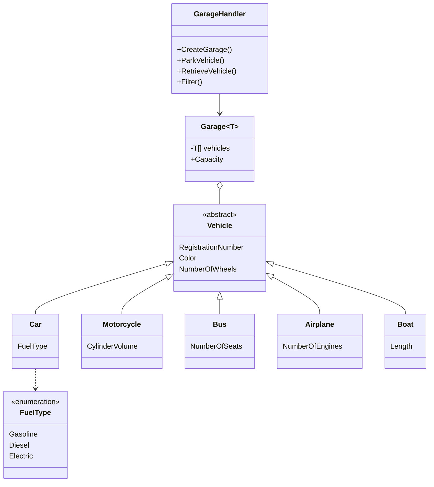

# Class Diagram — Garage 1.0

```mermaid
classDiagram
    direction TB

    class Vehicle {
        <<abstract>>
        RegistrationNumber
        Color
        NumberOfWheels
    }

    class Car { FuelType }
    class Motorcycle { CylinderVolume }
    class Bus { NumberOfSeats }
    class Airplane { NumberOfEngines }
    class Boat { Length }

    class FuelType {
        <<enumeration>>
        Gasoline
        Diesel
        Electric
    }

    class Garage~T~ {
        -T[] vehicles
        +Capacity
    }

    class GarageHandler {
        +CreateGarage()
        +ParkVehicle()
        +RetrieveVehicle()
        +Filter()
    }

    Vehicle <|-- Car
    Vehicle <|-- Motorcycle
    Vehicle <|-- Bus
    Vehicle <|-- Airplane
    Vehicle <|-- Boat

    Car ..> FuelType
    Garage~T~ o-- Vehicle
    GarageHandler --> Garage~T~
```
